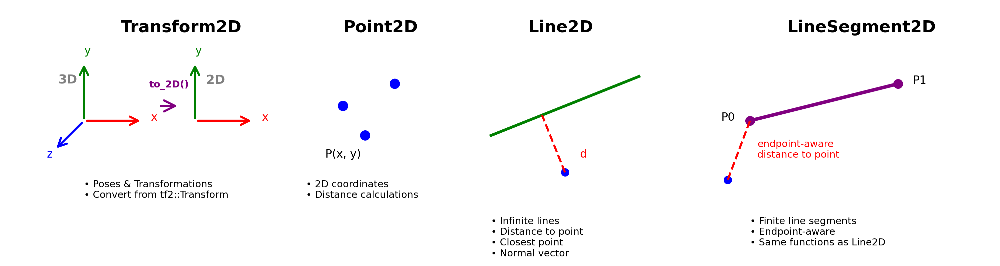

# tf2_geometry
2D geometry for tf2

## Transform2D
The Transform2D is a class which can be used to describe poses and transformations in 2D space. It can be generated from a classical tf2::Transform object using the functions:
* `tf2::Transform2D &tf2::to_2D(const Transform &src, tf2::Transform2D &des)` or
* `tf2::Transform2D tf2::to_Transform2D(const Transform &src)` 

There are also functions available to create directly Point2D objects:
* `tf2::Point2D &tf2::to_2D(const Transform &src, tf2::Point2D &des)` or
* `tf2::Point2D tf2::to_Point2D(const Transform &src)`

## Point2D, Line2D and LineSegment2D
Geometric objects are created easily with:
* `tf2::Point2D(const tf2Scalar &x, const tf2Scalar &y)` and
* `tf2::Line2D(const tf2::Point2D &p0, const tf2::Point2D &p1)` and
* `tf2::LineSegment2D(const tf2::Point2D &p0, const tf2::Point2D &p1)`

Point2D and Line2D provide:
* distance of point to line
* closest point on line
* normal 
* ...

Point2D and LineSegment2D also provide the same functions but take the line endpoints into account.